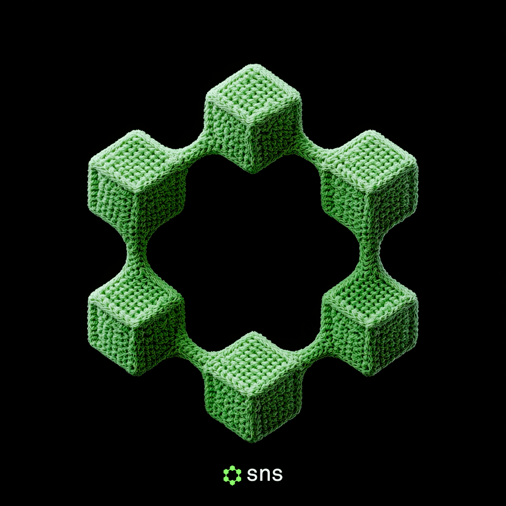
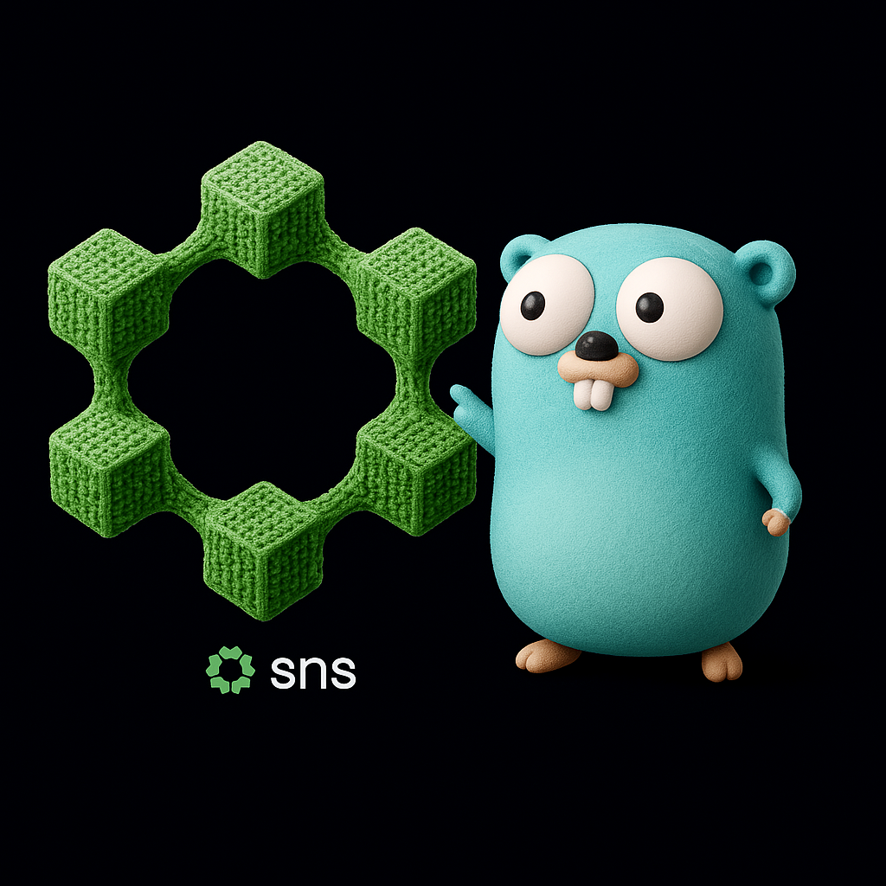

<h1 align="center">SNS Go SDK</h1>

<p align="center">

</p>

# Solana Name Servcie Go SDK

This is a rewrite of the [SNS](https://www.sns.id) Typescript [SDK](https://github.com/Bonfida/sns-sdk), in [Go](https://github.com/golang/go). This commit, tagged `0.1.0`, is aim at **correctness** to the [official JS/TS SDK](https://github.com/Bonfida/sns-sdk), which has been achieved by the merits of passing **all the tests ✅** in the native SDK. This commit tries to resemble very much of the conventions in the native SDK, such has directory naming, file naming, variable and function names (a little optimization was lost there) and also still carries the power of Golang concurency (goroutines) anywhere it was needed.

### WHY GO

Aside from the team’s mission to develop a Go library, JavaScript/Type~~Shit~~ is fundamentally a browser-oriented language—it is good software to keep it at that 🙂.

### WHAT HAS BEEN DONE SO FAR

The majority of the native codebase has been ported (more than 95%, others are the deprecated or unused funcs). At this point, I’d like the team to get involved and share their thoughts on how we should move forward and complete the remaining work. This commit aligns with the native SDK at commit `c1abc4d9f027f87835cbcd2473cbc51cf43abb58` on origin/main.

### MISSION

Time for Go to run Solana backends! Big shoutout to the devs behind 🍚 [solana-go](github.com/gagliardetto/solana-go").

### SETUP

The .env file

```bash
RPC_ENDPOINT=https://api.mainnet-beta.solana.com
TEST_PRIVATE_KEY=4B12eot34GyfDBcP7SCMb4r2H13tjuGkTKpgB9fpNZrq1iaNmrDpAS9xDDUVzoEiUjZiybFShX5UEhmhGWnFggj6
TEST_PUBLIC_KEY=12vQ7TQYPxUscvAfBAuf3pdiPAFRhC26qGCjztLfw7zk
```

If you’re using VS Code, you can streamline your workflow with the built-in testing UI. However, you’ll need to place the .env file in each directory where tests are present, as the VS Code UI Test uses the test directory as the working directory.

# 
